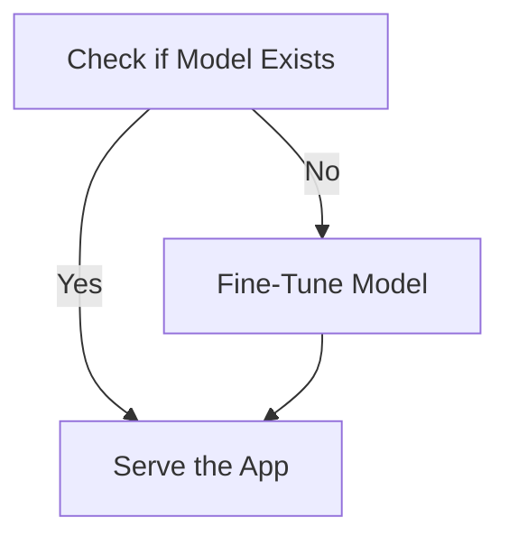

# ChatBot
[](https://github.com/egpivo/chatbot/actions)
[](https://codecov.io/gh/egpivo/chatbot)


## Installation

To install the `chatbot` Python package from this GitHub repository, you can use the following command:

```bash
pip install git+https://github.com/egpivo/chatbot.git
```
## Serving Process Flow

## Usage
### 1. Default Model Values
Run the ChatBot service with default model values:
```bash
make serve
```

### 2. Custom Model Values
Run the ChatBot service with custom model values:
```bash
bash cli/scripts/run_app_service.sh \
  --t5_pretrained_model {t5_model} \
  --t5_pretrained_vocoder {t5_vocoder} \
  --whisper_pretrained_model {whisper_model}
```
- **Note**: Replace `{t5_model}`, `{t5_vocoder}`, and `{whisper_model}` with actual values or placeholders for users to fill in.


## Reference
- [BentoChain Repository](https://github.com/ssheng/BentoChain)
