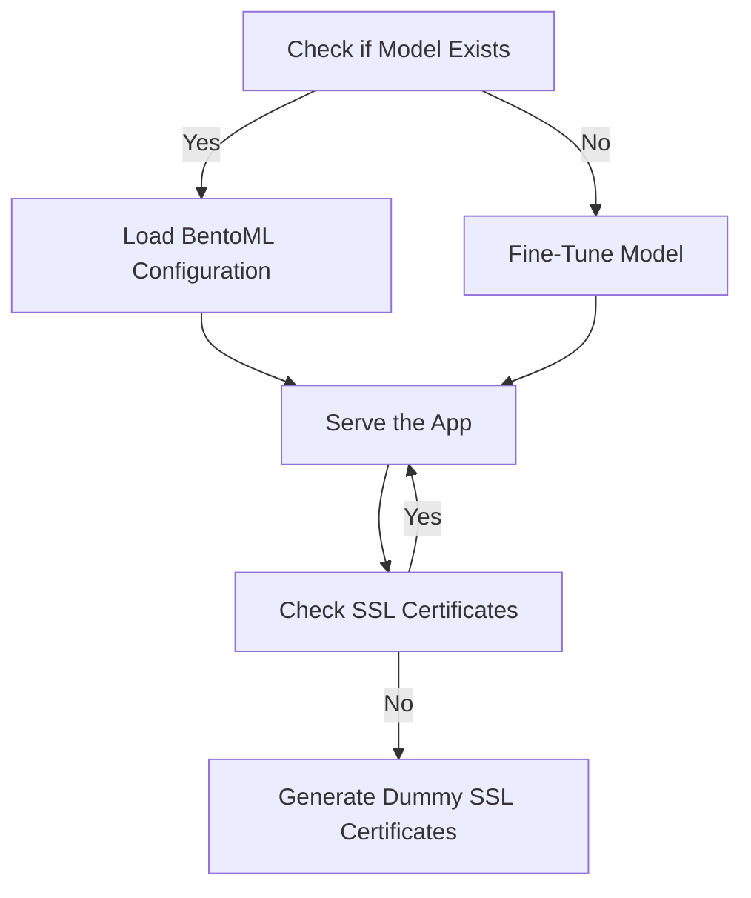
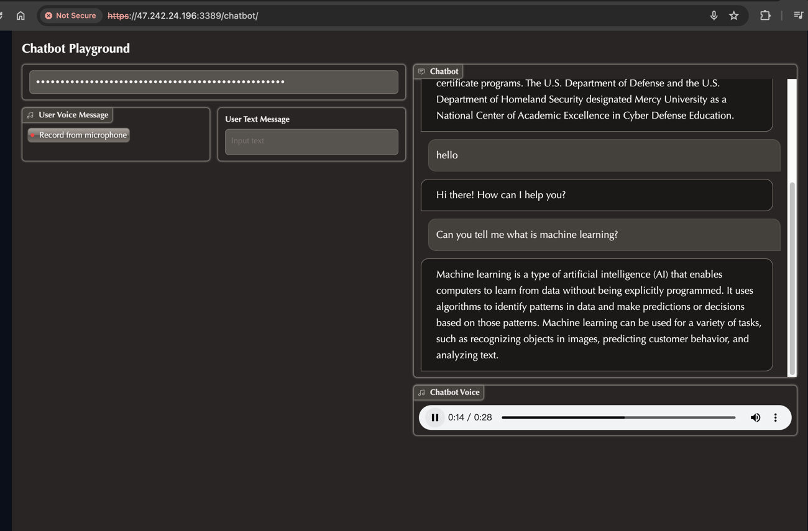

# Chatbot
[](https://github.com/egpivo/chatbot/actions)
[](https://codecov.io/gh/egpivo/chatbot)
<link rel="stylesheet" href="https://cdnjs.cloudflare.com/ajax/libs/font-awesome/5.15.3/css/all.min.css" integrity="sha512-...." crossorigin="anonymous" />


## Installation

To get the Chatbot Python package from this GitHub repository, use the following command:

```bash
pip install git+https://github.com/egpivo/chatbot.git
```
## Serving Automation
This repository automates the process of checking and fine-tuning pre-trained models for the Chatbot application. The automation script allows you to customize SpeechT5 and SWhisper models and enables retraining if needed.

### Serving Process Flow



### Artifact Folder
During the model serving process, the `artifact` folder is dynamically created to store the BentoML artifacts, essential for serving the Chatbot application.
## Usage
### I. Server Side

##### Local Model
###### 1. Default Model Values
 Run the Chatbot service with default model values:
```shell
make local-serve
```
##### 2. Customizing the Serving Process
Customize the Chatbot serving process using the automation script. Specify your desired models and options:
```shell
bash scripts/run_app_service.sh \
  --t5_pretrained_model {t5_model} \
  --t5_pretrained_vocoder {t5_vocoder} \
  --whisper_pretrained_model {whisper_model} \
  --is_retraining \
  --port {port}
```
- **Note**: Replace `{t5_model}`, `{t5_vocoder}`, `{whisper_model}, and `{port}` with your preferred values. Adding the `--is_retraining` flag forces model retraining.

##### Docker Model
Run the Chatbot service using Docker:

```shell
docker-compose up -d --build
```
or
```shell
make docker-serve
```

### II. Client Side
Access the demo chatbot at `https://{ip}:{port}/chatbot`, with the default values being `0.0.0.0` for the `ip` and `3389` for the `port`.

- Note: Dummy SSL certificates and keys are created by default for secure communication. You can replace them manually.

## Demo <i class="fas fa-eye fa-lg"></i>


- Explore the demo site hosted on Alibaba Cloud via https://egpivo.com/chatbot/.


- Note: This site is intended for demo purposes only, and there is no guarantee of computing efficiency.

## Remark
- Reference: [BentoChain Repository](https://github.com/ssheng/BentoChain)
- **License:** [BSD 2-Clause License](LICENSE)
